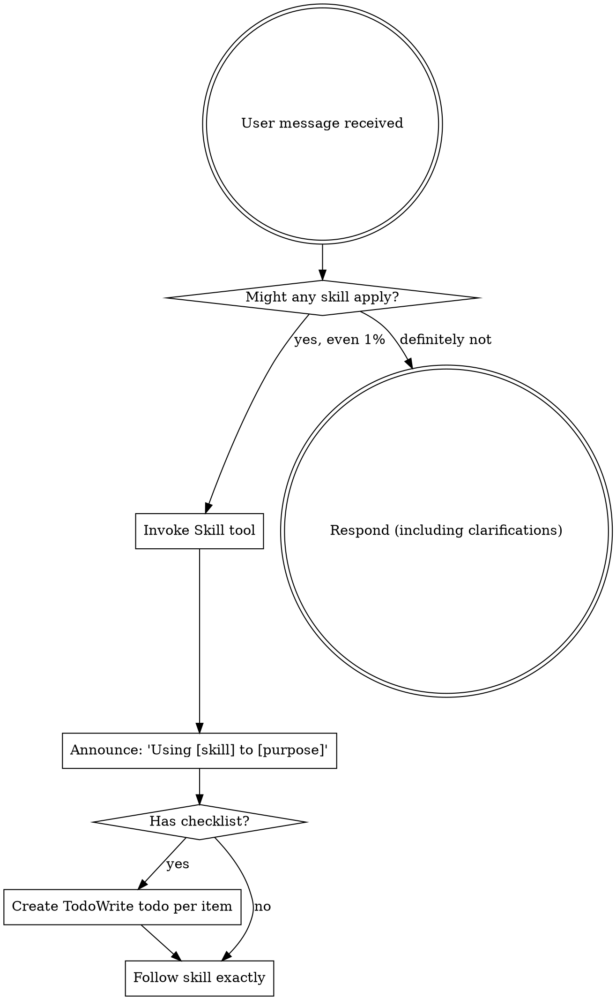

<SUBAGENT-STOP>
If you were dispatched as a subagent to execute a specific task, skip this skill.
</SUBAGENT-STOP>

<EXTREMELY-IMPORTANT>
If you think there is even a 1% chance an sp-compound skill might apply to what you are doing, you ABSOLUTELY MUST invoke the skill.

IF A SKILL APPLIES TO YOUR TASK, YOU DO NOT HAVE A CHOICE. YOU MUST USE IT.

This is not negotiable. This is not optional. You cannot rationalize your way out of this.
</EXTREMELY-IMPORTANT>

## Instruction Priority

sp-compound skills override default system prompt behavior, but **user instructions always take precedence**:

1. **User's explicit instructions** (CLAUDE.md, AGENTS.md, direct requests) — highest priority
2. **sp-compound skills** — override default system behavior where they conflict
3. **Default system prompt** — lowest priority

If CLAUDE.md or AGENTS.md says "don't use TDD" and a skill says "always use TDD," follow the user's instructions. The user is in control.

## How to Access Skills

Use the `Skill` tool. When you invoke a skill, its content is loaded and presented to you — follow it directly. Never use the Read tool on skill files.

# Using Skills

## The Rule

**Invoke relevant or requested skills BEFORE any response or action.** Even a 1% chance a skill might apply means you should invoke the skill to check. If an invoked skill turns out to be wrong for the situation, you don't need to use it.

## Skill Routing

### Core Workflow (in order)

| Trigger | Skill | Purpose |
|---------|-------|---------|
| New feature, creative work, behavior change | `sp-compound:brainstorm` | Turn ideas into requirements through collaborative Q&A |
| Have requirements or detailed idea | `sp-compound:plan` | Research codebase + create implementation plan with code |
| Have plan, ready to build | `sp-compound:work` | Execute plan using subagent architecture |
| Code complete, need review | `sp-compound:review` | Multi-reviewer code review with auto-fix |
| Problem solved, capture learning | `sp-compound:compound` | Document solution in .sp-compound/solutions/ knowledge store |
| Knowledge store maintenance | `sp-compound:compound-refresh` | Review and update stale .sp-compound/solutions/ entries |

### Supporting Skills

| Trigger | Skill | Purpose |
|---------|-------|---------|
| Bug, test failure, unexpected behavior | `sp-compound:debug` | Systematic root-cause investigation before fixing |
| Bug reported in a GitHub issue | `sp-compound:reproduce-bug` | Hypothesis-driven reproduction and investigation from issue reports |
| Received review feedback to address | `sp-compound:receiving-review` | Technical evaluation of review feedback before implementing |
| Implementing any feature/bugfix | `sp-compound:flexible-tdd` | TDD with strategy: test-first / characterization-first / pragmatic |
| About to claim work is done | `sp-compound:verification` | Evidence before claims — run verification, then report |
| Need isolated workspace | `sp-compound:git-worktree` | Create git worktree for parallel development |
| Ready to commit, push, and open PR | `sp-compound:git-commit-push-pr` | Adaptive PR descriptions that scale with change complexity |
| Implementation done, ship it | `sp-compound:finishing-branch` | Verify tests, present merge/PR/cleanup options |
| Creating or editing agent skills | `sp-compound:writing-skills` | TDD methodology for skill authoring — pressure test, write, refine |

### Workflow Chain

The skills chain automatically:
- `brainstorm` -> invokes `plan` when requirements approved
- `plan` -> invokes `work` when plan approved
- `work` -> invokes `review` when implementation complete
- `work` -> invokes `finishing-branch` after review passes
- `compound` is invoked either automatically by `finishing-branch` Step 4.5 (Options 1 or 2, notable-learning gate passes, no session kill switch) or manually by the user at any time

## Skill Priority

When multiple skills could apply:

1. **Process skills first** (brainstorm) — determine HOW to approach
2. **Implementation skills second** (work, flexible-tdd) — guide execution

"Let's build X" -> brainstorm first, then plan, then work.
"Fix this bug" -> debug first (find root cause), then flexible-tdd (test-first for the fix).

## Skill Types

**Rigid** (flexible-tdd test-first mode, verification): Follow exactly. Don't adapt away discipline.

**Flexible** (brainstorm, plan, review): Adapt principles to context.

The skill itself tells you which.

## Red Flags

These thoughts mean STOP — you're rationalizing:

| Thought | Reality |
|---------|---------|
| "This is just a simple question" | Questions are tasks. Check for skills. |
| "I need more context first" | Skill check comes BEFORE clarifying questions. |
| "Let me explore the codebase first" | Skills tell you HOW to explore. Check first. |
| "I can check git/files quickly" | Files lack conversation context. Check for skills. |
| "Let me gather information first" | Skills tell you HOW to gather information. |
| "This doesn't need a formal skill" | If a skill exists, use it. |
| "I remember this skill" | Skills evolve. Read current version. |
| "This doesn't count as a task" | Action = task. Check for skills. |
| "The skill is overkill" | Simple things become complex. Use it. |
| "I'll just do this one thing first" | Check BEFORE doing anything. |
| "This feels productive" | Undisciplined action wastes time. Skills prevent this. |
| "I know what that means" | Knowing the concept is not using the skill. Invoke it. |

## Knowledge Flywheel

sp-compound's unique value is the knowledge flywheel:
- `compound` writes learnings to `.sp-compound/solutions/`
- `plan` reads learnings to write better plans
- `review` reads learnings to catch known issues
- `brainstorm` reads learnings for scope/risk assessment
- `compound-refresh` maintains learnings accuracy

If `.sp-compound/solutions/` exists in the project, skills MUST search it for relevant history.

## User Instructions

Instructions say WHAT, not HOW. "Add X" or "Fix Y" doesn't mean skip workflows.
